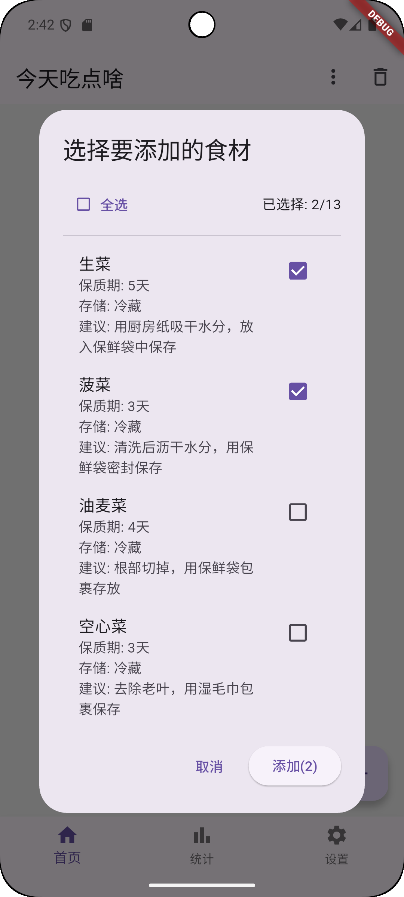
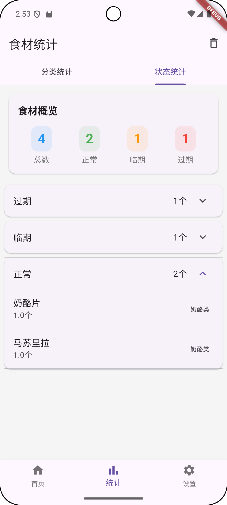
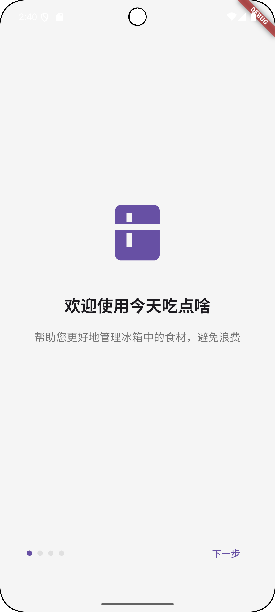

# 今天吃点啥 - 食材管理应用

一个帮助用户管理食材、避免浪费的跨平台应用。通过智能提醒和分类管理，让用户更好地管理厨房食材。

## 功能特点

### 1. 食材管理
- 添加、编辑和删除食材
- 支持设置数量、购买日期和保质期
- 智能分类管理
- 状态自动更新（正常、临期、过期）



### 2. 分类统计
- 按分类查看食材数量
- 食材状态统计
- 一键删除过期/临期食材
- 数据可视化展示



### 3. 智能提醒
- 每日定时提醒（6点、10点、14点、16点、20点）
- 临期食材提醒
- 过期食材提示
- 本地通知，无需联网

### 4. 食材字典
- 预设常见食材
- 默认保质期推荐
- 存储建议
- 快速添加功能

### 5. 批量操作
- 多选删除
- 按状态批量删除
- 按分类批量删除
- 操作确认保护

## 技术特点

- 使用 Flutter 开发，支持 Android、iOS 平台
- 本地数据库存储，无需联网
- 原生通知集成
- Material Design 设计风格
- Provider 状态管理

## 安装要求

- Android 5.0 (API 21) 或更高版本
- iOS 11.0 或更高版本
- 存储权限（用于数据库）
- 通知权限（用于提醒功能）

## 开发环境

- Flutter 3.0.0 或更高版本
- Dart 2.17.0 或更高版本
- Android Studio / VS Code
- Android SDK
- Xcode（用于 iOS 开发）

## 主要依赖

```yaml
dependencies:
  flutter:
    sdk: flutter
  sqflite: ^2.3.0
  provider: ^6.0.5
  shared_preferences: ^2.2.1
  intl: ^0.18.1
  path_provider: ^2.1.1
```

## 项目结构

```
lib/
├── main.dart              # 应用入口
├── pages/                 # 页面文件
├── models/               # 数据模型
├── providers/            # 状态管理
├── services/            # 服务类
├── database/            # 数据库相关
└── utils/               # 工具类
```

## 使用说明

### 首次使用
1. 安装应用后首次打开会显示引导页
2. 授予必要权限（存储、通知）
3. 开始使用主要功能



### 添加食材
1. 点击右下角"+"按钮
2. 填写食材信息
3. 设置数量和日期
4. 保存即可


### 查看统计
1. 点击底部导航栏的"统计"
2. 查看分类统计和状态统计
3. 可进行批量操作


## 更新日志

### v1.0.0 (2025-02-09)
- 初始版本发布
- 实现基础食材管理功能
- 添加通知提醒功能
- 支持批量操作
- 集成食材字典


## 开发计划

- [ ] 添加条码扫描功能
- [ ] 支持自定义分类
- [ ] 添加食谱推荐
- [ ] 数据备份与恢复
- [ ] 多设备同步


